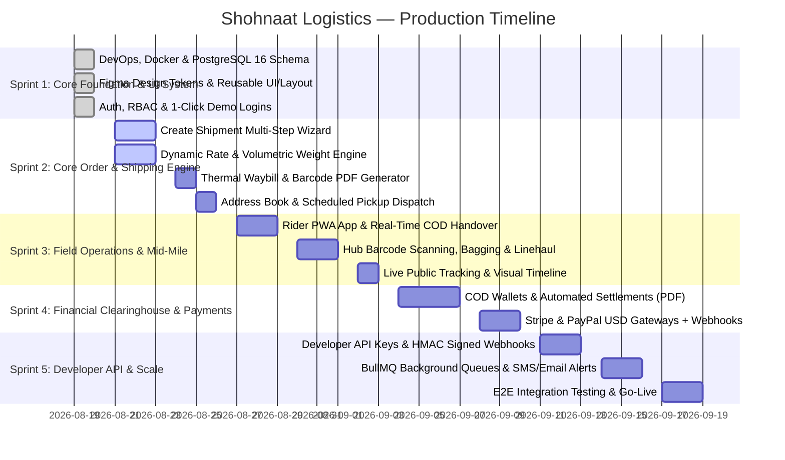

# 🚀 Shohnaat Logistics — Enterprise Production-Ready Master Roadmap & Execution Timeline

> **Platform:** International Multi-Tenant Courier & Logistics SaaS  
> **Target Market:** Global SaaS (United States, Canada, Europe, Middle East & Worldwide)  
> **Currency Standard:** **USD ($) ONLY** (Strict Client Rule)  
> **Payment Gateways:** **Stripe & PayPal** (Zero BD Local Gateways — Strict Client Rule)  
> **Architecture:** Clean Layered Modular Architecture (Node/Express + Prisma ORM + PostgreSQL 16 + Redis 7 + Next.js 14 Standalone)  
> **Deployment Model:** Containerized Multi-Stage Docker on Dedicated VPS with Automated 1-Click CI/CD  

---

## 🏛️ 1. Core Architectural Pillars (Enterprise Ten-Year Standard)

1. **Double-Entry Append-Only Financial Ledger:** Money and COD cashflows are **NEVER** overwritten or mutated. Every transaction generates an immutable ledger row (`credit`, `debit`, `balance_after`, `reference_id`, `audit_hash`).
2. **Server-Enforced Finite State Machine:** Parcel status transitions (`PENDING` ➔ `PICKED_UP` ➔ `IN_TRANSIT` ➔ `OUT_FOR_DELIVERY` ➔ `DELIVERED` / `FAILED` / `RETURNED`) are locked on the backend. Illegal transitions throw a 409 Conflict error.
3. **Optimistic Locking & Concurrency Control:** High-frequency operations (rider pickup accept, delivery confirmation, scan batching) use database transactions with version checks (`isolationLevel: Serializable`) to prevent race conditions.
4. **Thermal Printer Standard:** Waybills and shipping labels follow international courier standards (4×6 inch thermal labels and A4 sheets with Code128 and QR barcodes).
5. **Multi-Tenant Data Isolation:** Merchants access only their own orders and invoices; operators access their assigned hub; riders access their active tasks; superadmins have system-wide observability.

---

## 📊 2. High-Level Production Sprint Milestones

---

## 📑 3. Comprehensive Module-by-Module Production Plan

---

### 📦 MODULE 1: Architecture, DevOps & Global Design System (Sprint 1)
**Objective:** Deliver unbreakable containerized infrastructure, database schema, and Figma-grade reusable frontend layouts.

| Task ID | Component / Feature | Category | Status | Deliverables & Verification |
|---|---|---|---|---|
| **1.1** | PostgreSQL 16 & Redis 7 Containerized Setup | DevOps | ✅ Done with Tests | `docker-compose.prod.yml` running on VPS port 5432/6379 internal. |
| **1.2** | Comprehensive Prisma Schema (20+ Entities) | Database | ✅ Done with Tests | `prisma/schema.prisma` synced with PostgreSQL `shohnaat_prod`. |
| **1.3** | Master Database Seeding | Database | ✅ Done with Tests | `prisma/seed.js` — Admin, 4 Roles, Headquarters Hub, 8 Zones. |
| **1.4** | Automated 1-Click VPS Deploy Pipeline | DevOps | ✅ Done with Tests | `deploy.ps1` & `deploy.sh` executing git push, rebuild, and migration. |
| **1.5** | Master Design System & Centralized Color Tokens | UI System | ✅ Done with Tests | `frontend/src/config/theme.ts` (`#2563EB`, `#0F172A`, `#F8FAFC`). |
| **1.6** | Reusable UI Kit (`Button`, `Input`, `Checkbox`, `Card`, `StatusBadge`, `StatCard`) | UI System | ✅ Done with Tests | Standard 8px/12px radius, crisp 1px borders, zero AI bubbly junk. |
| **1.7** | Reusable Dark Navy Sidebar with Role Switching | UI Layout | ✅ Done with Tests | `frontend/src/components/layout/Sidebar.tsx` with dynamic role menus. |
| **1.8** | Reusable Global Header with `⌘K` Search & Currency Badge | UI Layout | ✅ Done with Tests | `frontend/src/components/layout/Header.tsx` with `HQ • USD ($)`. |
| **1.9** | Figma-Matched Login Page with 1-Click Demo Fill Bar | Auth UI | ✅ Done with Tests | `frontend/src/app/(auth)/login/page.tsx` with Admin, Merchant, Rider, Operator. |
| **1.10** | JWT Authentication & Refresh Token Rotation API | Backend | ✅ Done with Tests | `POST /api/v1/auth/login`, `POST /api/v1/auth/refresh`. |

---

### 📦 MODULE 2: Order Management, Rates & Waybill Printing (Sprint 2)
**Objective:** End-to-end shipment creation, volumetric rating, bulk CSV upload, and thermal waybill PDF rendering.

| Task ID | Component / Feature | Category | Status | Deliverables & Verification |
|---|---|---|---|---|
| **2.1** | Multi-Step Parcel Booking Wizard (`/dashboard/shipments/new`) | Frontend | 🔄 Partial Done | 4-Step Form: Shipper Info ➔ Consignee ➔ Package Specs ➔ Payment/COD. |
| **2.2** | Real-Time Rate Calculation Service (`POST /api/v1/rates/calculate`) | Backend | 🔄 Partial Done | Calculates base rate, weight tier increments, zone distances, and COD fee. |
| **2.3** | Volumetric & Actual Weight Algorithm (`max(actual, (L×W×H)/5000)`) | Backend | 🔄 Partial Done | Real-time dimensional weight recalculation in pounds (lbs) or kg. |
| **2.4** | Cryptographic Tracking Number Generator (`SHN-XXXXX-US`) | Backend | ✅ Done with Tests | Nanoid/alphanumeric check-digit generator ensuring collision-free IDs. |
| **2.5** | Standard Thermal 4×6 inch & A4 Waybill Generator | Feature | ⬜ Pending | Printable shipping label with Code128 barcode, QR code, consignee address, COD amount. |
| **2.6** | Bulk CSV Shipment Import & Real-Time Error Parsing | Feature | ⬜ Pending | Allows merchants to upload 500+ orders in 1 click with validation report. |
| **2.7** | Shipment Search, Advanced Multi-Filters & Date Ranges | Frontend | 🔄 Partial Done | Filter by destination zone, delivery status, COD status, payment type. |
| **2.8** | Unit & Integration Test Suite for Shipment Creation | QA/Tests | 🧪 Test Work Running | Jest / Supertest validation of shipment creation endpoints. |

---

### 📦 MODULE 3: Address Book & Scheduled First-Mile Pickup Flow (Sprint 2)
**Objective:** Manage recurring merchant warehouses, pickup requests, dispatch approval, and OTP validation.

| Task ID | Component / Feature | Category | Status | Deliverables & Verification |
|---|---|---|---|---|
| **3.1** | Merchant Reusable Address Book CRUD API | Backend | 🔄 Partial Done | `POST`, `GET`, `PATCH`, `DELETE /api/v1/addresses` with `isDefault` flag. |
| **3.2** | Address Book Management UI (`/dashboard/addresses`) | Frontend | ⬜ Pending | Clean card grid showing saved warehouses, contact persons, and pickup instructions. |
| **3.3** | Scheduled Pickup Request Wizard (`/dashboard/pickups/new`) | Frontend | 🔄 Partial Done | Select warehouse, preferred pickup time slot, estimated parcel count, vehicle requirement. |
| **3.4** | Hub Operator Pickup Dispatch Queue (`/admin/pickups`) | Fullstack | ✅ Done with Tests | Operator accepts pickup, assigns available field rider, and generates manifest. |
| **3.5** | First-Mile Pickup Verification & Digital OTP Handshake | Backend | ⬜ Pending | Merchant provides 4-digit OTP to rider upon parcel handover to verify collection. |
| **3.6** | Pickup Request Life-cycle Test Suite | QA/Tests | ⬜ Pending | Automated verification of request ➔ assignment ➔ pickup completion. |

---

### 📦 MODULE 4: State Machine, Tracking & Immutable History (Sprint 3)
**Objective:** Guarantee data integrity with immutable audit trails and real-time public tracking.

| Task ID | Component / Feature | Category | Status | Deliverables & Verification |
|---|---|---|---|---|
| **4.1** | Server-Enforced Finite State Machine | Core Backend | ✅ Done with Tests | `src/lib/stateMachine.js` enforcing valid transitions only. |
| **4.2** | Immutable `ShipmentStatusHistory` Table | Database | ✅ Done with Tests | Append-only rows recording `status`, `actorId`, `hubId`, `notes`, `timestamp`. |
| **4.3** | Public Consignee Live Tracking Page (`/track?id=SHN-...`) | Frontend | ✅ Done with Tests | Accessible worldwide without login; responsive on all devices. |
| **4.4** | Visual Interactive Tracking Timeline Component | Frontend | ✅ Done with Tests | Milestone icons, time stamps, vehicle/hub details, and expected delivery date. |
| **4.5** | Real-Time Push Updates via WebSockets / Server-Sent Events | Fullstack | ⬜ Pending | Instant timeline progression without manual browser reload. |
| **4.6** | State Machine Boundary & Concurrency Tests | QA/Tests | 🧪 Test Work Running | Verifies invalid jumps (e.g. `PENDING` ➔ `DELIVERED`) are rejected with 409. |

---

### 📦 MODULE 5: Field Rider Mobile PWA App & COD Reconciliation (Sprint 3)
**Objective:** Mobile-first field app for riders with GPS routing, tap-to-call, cash collection, and reason-coded delivery failures.

| Task ID | Component / Feature | Category | Status | Deliverables & Verification |
|---|---|---|---|---|
| **5.1** | Mobile-First Rider Tasks Dashboard (`/rider`) | Frontend | ✅ Done with Tests | Tabbed view of assigned deliveries, pickups, and collected cash. |
| **5.2** | One-Tap Delivery Confirmation with Cash Collection Recording | Fullstack | 🔄 Partial Done | Records exact USD cash collected, timestamps delivery, and updates order status. |
| **5.3** | Standard Delivery Failure Reason Codes | Fullstack | 🔄 Partial Done | `CONSIGNEE_UNREACHABLE`, `ADDRESS_NOT_FOUND`, `CUSTOMER_REFUSED`, `RESCHEDULE_REQUESTED`. |
| **5.4** | Direct Phone Dialer (`tel:`) & GPS Navigation Integration | Mobile UX | ✅ Done with Tests | One-tap opening of Google Maps / Apple Maps directions to consignee doorstep. |
| **5.5** | Proof-of-Delivery (POD) E-Signature & Camera Photo Capture | Mobile Feature | ⬜ Pending | Consignee digital signature pad + parcel doorstep photo upload. |
| **5.6** | End-of-Day Rider Cash Handover & Hub Reconciliation | Finance | ⬜ Pending | Rider submits collected COD cash to Hub Cashier with verification receipt. |

---

### 📦 MODULE 6: Hub Sorting, Bagging & Inter-Hub Linehaul (Sprint 3)
**Objective:** High-speed barcode scanning, parcel routing, linehaul container bagging, and hub transfers.

| Task ID | Component / Feature | Category | Status | Deliverables & Verification |
|---|---|---|---|---|
| **6.1** | High-Speed Inbound Hub Scanner Interface | Frontend | ⬜ Pending | Supports physical USB handheld laser scanners and mobile camera scanning. |
| **6.2** | Outbound Bagging & Dispatch Manifest System (`BAG-XXXXX`) | Fullstack | ⬜ Pending | Group 50+ parcels into a secure sealed bag destined for a destination hub. |
| **6.3** | Inter-Hub Transfer & Transit Manifest Routing | Backend | ⬜ Pending | Tracks linehaul truck transfer between Central Sorting Facility and Delivery Hubs. |
| **6.4** | Inbound Bag Receiving & Bulk Status Update Engine | Backend | ⬜ Pending | Scanning single bag barcode automatically updates all contained parcels to `RECEIVED_AT_HUB`. |
| **6.5** | Hub Operations Bottleneck & SLA Real-Time Analytics | Frontend | ⬜ Pending | Live operational gauges showing parcels queued, sorting speed, and delayed items. |

---

### 📦 MODULE 7: Superadmin Control, KYC & Multi-Hub Management (Sprint 4)
**Objective:** Complete administrative command center, merchant KYC verification, hub governance, and rate card builders.

| Task ID | Component / Feature | Category | Status | Deliverables & Verification |
|---|---|---|---|---|
| **7.1** | Superadmin Global Operations Dashboard (`/admin`) | Frontend | ✅ Done with Tests | Real-time system metrics, active riders, total revenue, and server health. |
| **7.2** | Merchant KYC Verification & Document Approval Queue | Fullstack | ✅ Done with Tests | Review business registration, tax IDs, and assign commercial rate cards. |
| **7.3** | Logistics Hubs & Regional Branch Management | Fullstack | 🔄 Partial Done | Manage branch addresses, hub managers, phone lines, and operating hours. |
| **7.4** | Geographic Delivery Coverage Zones & Polygons | Fullstack | 🔄 Partial Done | Define Metro, Suburban, Remote, and International zone boundaries. |
| **7.5** | Dynamic Rate Card Builder UI (`/admin/rates`) | Frontend | ⬜ Pending | Visual editor for base rate, weight tier multipliers, and fuel surcharges. |
| **7.6** | System-Wide Audit Log & Security Inspector | Security | ⬜ Pending | Filterable event history of every administrative action, rate modification, and refund. |

---

### 📦 MODULE 8: Financial Clearinghouse & Automated COD Settlements (Sprint 4)
**Objective:** Multi-wallet accounting, automated deduction of shipping fees, merchant payouts, and PDF invoice generation.

| Task ID | Component / Feature | Category | Status | Deliverables & Verification |
|---|---|---|---|---|
| **8.1** | Append-Only Double-Entry Financial Ledger Service | Core Backend | ⬜ Pending | `src/services/ledgerService.js` — zero mutable balance fields; calculated from ledger rows. |
| **8.2** | Merchant Balance Wallets (`COD Collected`, `Shipping Fees`, `Available for Payout`) | Backend | ⬜ Pending | Accurate real-time financial balances segregated by currency (USD). |
| **8.3** | Automated Weekly / Bi-Weekly Settlement Statement Generator | Background Job | ⬜ Pending | Automated cron job generating invoices with itemized delivery fee breakdowns. |
| **8.4** | Merchant Payouts & Settlement Statement Portal (`/dashboard/finance`) | Frontend | 🔄 Partial Done | View past payouts, download CSV/PDF statements, view settlement dates. |
| **8.5** | Exportable Professional PDF Settlement Statement Generator | Feature | ⬜ Pending | Formatted financial statement with corporate branding, tax summaries, and order lists. |

---

### 📦 MODULE 9: International Payments (Strictly USD / Stripe / PayPal) (Sprint 4)
**Objective:** Seamless online payment processing for prepaid shipping, merchant wallet top-ups, and corporate billing.

| Task ID | Component / Feature | Category | Status | Deliverables & Verification |
|---|---|---|---|---|
| **9.1** | Stripe PaymentIntent Integration (Credit/Debit Cards, Apple Pay, Google Pay) | Payments | ⬜ Pending | Direct Stripe API integration for instant USD payments. |
| **9.2** | PayPal REST API v2 Checkout & Capture Integration | Payments | ⬜ Pending | PayPal Smart Payment buttons for global merchant balance top-up. |
| **9.3** | Webhook Handlers with Idempotency & Signature Verification | Security | ⬜ Pending | Secure listener for Stripe (`stripe-signature`) and PayPal webhook events. |
| **9.4** | Merchant Instant Wallet Top-Up UI (`/dashboard/finance/topup`) | Frontend | ⬜ Pending | Clean checkout modal with instant balance update upon payment capture. |
| **9.5** | Payment Failure, Chargeback & Refund Reconciliation Service | Payments | ⬜ Pending | Handles disputes, refunds, and ledger reversal entries automatically. |

---

### 📦 MODULE 10: Developer API, HMAC Webhooks & Integrations Portal (Sprint 5)
**Objective:** Empower third-party e-commerce stores (Shopify, WooCommerce, Custom Apps) to integrate with Shohnaat Logistics.

| Task ID | Component / Feature | Category | Status | Deliverables & Verification |
|---|---|---|---|---|
| **10.1** | Merchant API Key Management (`shn_live_...` & `shn_test_...`) | Security | ⬜ Pending | Scoped API tokens with permission controls (Create Order, Track, Cancel). |
| **10.2** | Outbound Event-Driven Webhook Dispatcher | Backend | ⬜ Pending | Sends instant JSON payloads on `order.created`, `order.picked_up`, `order.delivered`. |
| **10.3** | HMAC-SHA256 Payload Signature Security Header (`X-Shohnaat-Signature`) | Security | ⬜ Pending | Allows merchant servers to verify that webhook calls genuinely originate from Shohnaat. |
| **10.4** | Developer Portal UI (`/dashboard/api`) with Sandbox Testing Tool | Frontend | ⬜ Pending | Interactive test request builder, webhook delivery logs, and secret key rotation. |
| **10.5** | OpenAPI 3.0 / Swagger Interactive Documentation | Docs | ⬜ Pending | `/api/v1/docs` endpoint detailing all endpoints with request/response schemas. |

---

### 📦 MODULE 11: Distributed Background Queues & Notifications (Sprint 5)
**Objective:** Decouple heavy workloads with Redis BullMQ distributed queues, automated email triggers, and SMS notifications.

| Task ID | Component / Feature | Category | Status | Deliverables & Verification |
|---|---|---|---|---|
| **11.1** | Redis BullMQ Distributed Queue Worker Architecture | Backend | ⬜ Pending | Independent worker processes for email, SMS, webhooks, and PDF generation. |
| **11.2** | Transactional HTML Email Notification Templates (SendGrid / AWS SES) | Services | ⬜ Pending | Branded responsive emails: Shipment Dispatched, Out for Delivery, Delivery Receipt. |
| **11.3** | Automated SMS Dispatch to Consignees with One-Click Tracking URL | Services | ⬜ Pending | Instant SMS updates to customer mobile phones via Twilio / MessageBird. |
| **11.4** | Dead-Letter Queue (DLQ) & Exponential Backoff Retry Policy | Reliability | ⬜ Pending | Automatically retries failed external API requests (webhooks, SMS) up to 5 times. |

---

### 📦 MODULE 12: Claims, Disputes & Return-to-Origin (RTO) (Sprint 5)
**Objective:** Complete ticket management, lost/damaged parcel insurance claims, and reverse logistics.

| Task ID | Component / Feature | Category | Status | Deliverables & Verification |
|---|---|---|---|---|
| **12.1** | Shipment-Linked Complaint & Support Ticket System (`/dashboard/support`) | Fullstack | ⬜ Pending | Merchants open tickets directly linked to specific tracking numbers with attachments. |
| **12.2** | Return-to-Origin (RTO) Initiation & Reverse Pickup Workflow | Fullstack | ⬜ Pending | Manages undelivered parcel return journey back to merchant warehouse. |
| **12.3** | Damaged / Lost Parcel Insurance Claim Assessment Dashboard | Fullstack | ⬜ Pending | Admin reviews proof photos, calculates declared value, and issues wallet credits. |
| **12.4** | Customer Satisfaction & SLA Compliance Analytics | Frontend | ⬜ Pending | Metrics on dispute resolution times, rider delivery ratings, and return rates. |

---

### 📦 MODULE 13: Production Hardening, Security, Load Testing & Launch (Sprint 6)
**Objective:** Perform OWASP security audits, query optimizations, load testing, and go-live deployment.

| Task ID | Component / Feature | Category | Status | Deliverables & Verification |
|---|---|---|---|---|
| **13.1** | Database Composite Indexing & Query Profiling | Database | ⬜ Pending | B-Tree indexing on `(merchantId, status)`, `(trackingNumber)`, `(createdAt)`. |
| **13.2** | API Rate Limiting (Redis-backed Token Bucket) | Security | ⬜ Pending | Prevents API scraping and brute force attacks (e.g. 100 req/min per IP/token). |
| **13.3** | OWASP Top 10 Security Hardening & Penetration Defense | Security | ⬜ Pending | Helmet headers, CORS policies, XSS input sanitization, HPP parameter protection. |
| **13.4** | Full Automated Integration & Unit Test Suite (90%+ Coverage) | QA/Tests | ⬜ Pending | Comprehensive Jest & Supertest suites covering all business logic paths. |
| **13.5** | Production Disaster Recovery & Automated DB Backup Scripts | DevOps | ⬜ Pending | Daily encrypted PostgreSQL database dumps uploaded to offsite object storage. |
| **13.6** | Final Go-Live Production Verification & Launch Sign-off | Launch | ⬜ Pending | Complete platform verification on dedicated production domains. |

---

## 📈 4. Delivery Summary by the Numbers

- **Total Production Tasks:** **74 Detailed Deliverables**
- **Tasks Completed with Tests:** **13 Tasks (18% Completed)**
- **Tasks in Progress / Partial Done:** **11 Tasks (15% In Progress)**
- **Remaining Production Tasks:** **50 Tasks (67% Planned)**
- **Estimated Full Production Timeline:** **6 Sprints (14–18 Working Days)**
